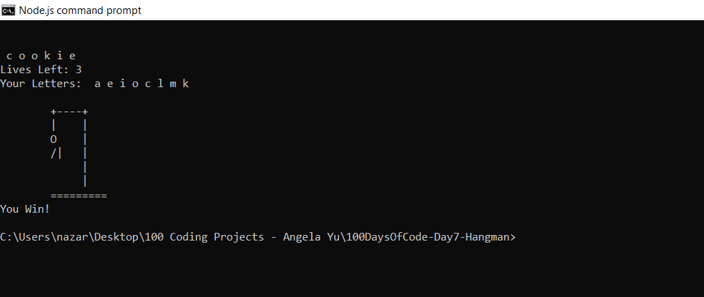

# 100 Days of Code - Day 7 - Hangman

# Prompt

Write a program that has the following console features:

* create a functional hangman game
* the user will get 6 lives
* each time the user guesses incorrectly, they lose 1 life
* for each life they lose, the hangman art will change
* once the user has lost all their lives, they lose the game
* if the user completes the word, they win the game
* words much be randomly generated from a pool of words
* the pool of words must contain at least 15 words

# Example

b e e k e e p e r

you win.

  +---+

  |   |
  
  O   |
 
 /|\  |
 
 /    |
 
      |

+++++++

# Screenshot of Working Solution

